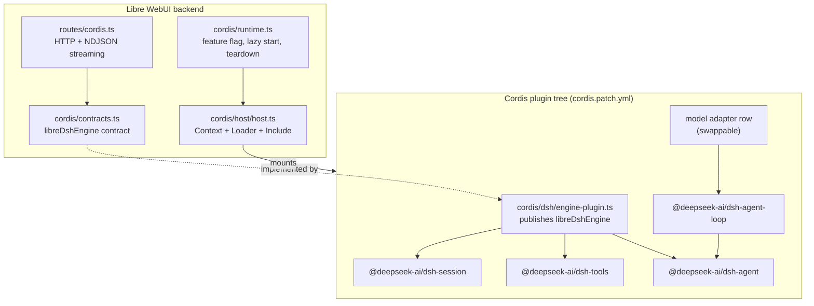
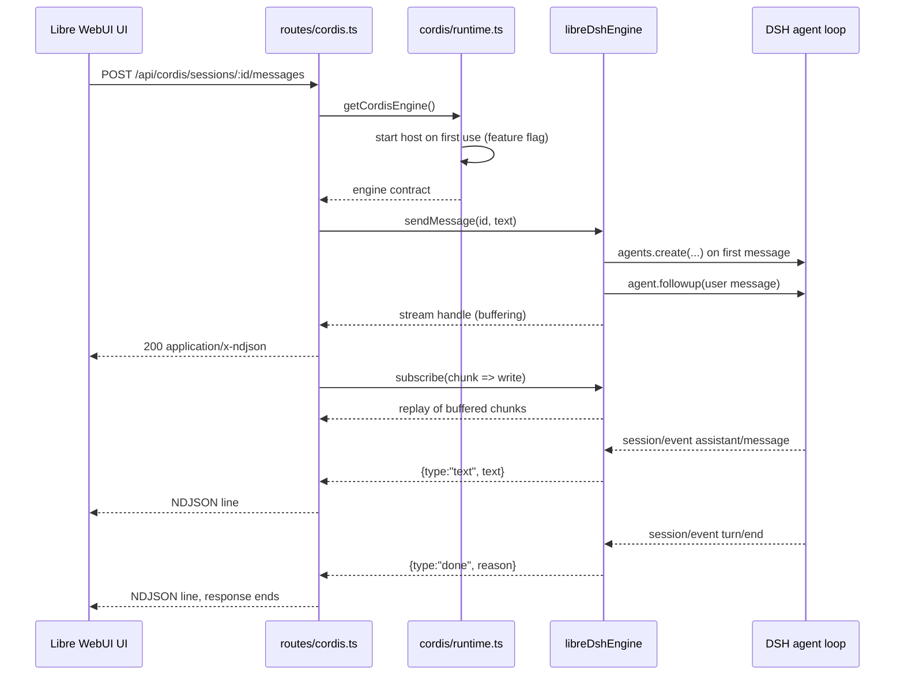
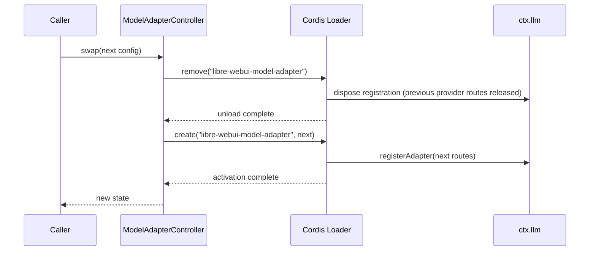

# Cordis Bridge

The Cordis bridge embeds the DeepSeek Harness (DSH) engine inside Libre WebUI's
backend. DSH runs as a plugin tree inside a
[Cordis](https://github.com/cordiverse/cordis) runtime hosted by Libre WebUI, so
its capabilities arrive as Cordis services rather than as imported modules.

The bridge is **off by default**. Nothing on this page happens until an operator
enables it (see [Cordis Configuration](./65-CORDIS_CONFIGURATION.md)).

## Why a bridge instead of a direct integration

Importing DSH's packages from Libre WebUI's services would be shorter and worse.
A direct import makes the engine a compile-time dependency, so changing a model
adapter, swapping the agent loop, or removing the engine means editing and
redeploying Libre WebUI.

The bridge inverts that. Libre WebUI depends on one abstract contract, and a
Cordis composition document decides what satisfies it:

- **Retarget without a rebuild.** The composition is a YAML file, so pointing
  the engine at a different provider is a configuration change.
- **Swap without a restart.** Each capability is a loader row. Replacing the
  model adapter row replaces the adapter while the session store, tool registry,
  and agent registry keep running.
- **Remove cleanly.** Every service, listener, and effect the engine installs is
  owned by the root fiber. Disposing that fiber rolls all of it back, so an
  operator can stop the engine without restarting Libre WebUI.

## Layers

Only `backend/src/cordis/dsh/engine-plugin.ts` names a concrete
`@deepseek-ai/dsh-*` package, and only for types. Everything above it — routes,
runtime, contracts — is engine-agnostic, which is what makes the engine
replaceable.

## Contracts

The contract lives in `backend/src/cordis/contracts.ts`. It is deliberately
narrow: the shapes Libre WebUI's API needs, expressed without engine vocabulary.

| Contract                         | Purpose                                                                 |
| -------------------------------- | ----------------------------------------------------------------------- |
| `DshEngine.status()`             | Lifecycle state of each engine service (`pending` / `ready` / `failed`) |
| `DshEngine.listSessions()`       | Session summaries, newest first                                         |
| `DshEngine.getSession(id)`       | One session with its projected messages                                 |
| `DshEngine.createSession(opts)`  | Reserve a session id and working directory                              |
| `DshEngine.deleteSession(id)`    | End a session and dispose its agent                                     |
| `DshEngine.listAgents()`         | Live agents, flagged as root or child                                   |
| `DshEngine.listTools()`          | Model-facing tools the engine registered                                |
| `DshEngine.sendMessage(id, txt)` | Start a turn and return a stream handle                                 |
| `DshEngine.cancel(id)`           | Cancel the in-flight turn for a session                                 |

The contract is published as the Cordis service `libreDshEngine`, so a consumer
reads it with `ctx.get('libreDshEngine')` and never imports the bridge module.

`EngineStreamChunk` is the streaming vocabulary: `text`, `tool-call`,
`tool-result`, and `done`. `sendMessage` returns a handle whose `subscribe`
replays anything already emitted, so a fast first token cannot be lost between
the engine starting the turn and the HTTP handler attaching its listener.

## Sequence: one chat turn

NDJSON is used rather than a WebSocket because a turn is a single
server-to-client sequence after the request. Keeping it on the POST avoids a
second handshake, ticket, and reconnect protocol, and keeps the whole turn
inside one authenticated request.

## DONE and PENDING

Cordis activates a plugin when the services it declares are available, so a row
spends time in states that are not "running yet". Two distinct notions matter,
and confusing them is the most common source of a silent engine.

**Loader entry state.** The Loader tracks each row through
`PENDING → LOADING → ACTIVE`, or `FAILED`. A row whose declared services are
missing stays pending indefinitely rather than failing, which is why an
incomplete composition produces an engine that starts but serves nothing.

**Service availability.** The host reports each expected service as:

| State     | Meaning                       | Cause                                               |
| --------- | ----------------------------- | --------------------------------------------------- |
| `pending` | Not registered on the context | The providing row has not activated, or is disabled |
| `ready`   | Registered and usable         | The providing row activated                         |
| `failed`  | Declared but unusable         | Reported with a `detail` string                     |

`host.status()` lists every expected service with its availability and names the
required ones that are missing; `GET /api/cordis/health` exposes the same
information. A composition that omits a required service makes startup throw
rather than publish an engine that answers with empty lists.

Two dependency chains are easy to get wrong:

- `dsh-tools` cannot start without `systemPrompt`.
- `dsh-agent-loop` cannot start until `agents`, `sessions`, `llm`, `tools`,
  `systemPrompt`, and `sessionProjections` all exist.

A composition missing any of those produces a working session store and an
engine that never answers a message.

## Hot swap

`ModelAdapterController` owns the single loader row named
`libre-webui-model-adapter`. Swapping removes that row and creates a new one:

Two details make this correct rather than merely plausible:

- **Removal is awaited.** `Loader.remove()` is asynchronous and only resolves
  once the entry's fiber has unloaded. A fire-and-forget removal leaves the
  previous adapter's provider routes registered, and the replacement then fails
  with `an adapter for provider "<name>" is already registered`.
- **A failed swap is restored.** If the new adapter cannot mount, the previous
  configuration is mounted again, so a rejected swap is not also an outage. The
  caller still receives the error.

Nothing outside the adapter row is touched: the session store, tool registry,
and agent registry are unaffected, and sessions created before the swap remain
readable after it.

## Rollback

Disposing the host's root fiber removes everything the engine installed. That
single ownership edge is the whole guarantee, and it holds because:

- Services are registered by plugins, so they are withdrawn with their fiber.
- `session/event` subscriptions are registered inside the bridge's own
  constructor and belong to the bridge row's fiber.
- Agent handles are tracked by the bridge and disposed in its teardown effect.
- The host disposes the root context, which owns every row.

`stopCordisHost()` is idempotent, and it is wired into the backend's shutdown
sequence so the engine's timers and file handles are released rather than left
to process exit.

## Session identity

A session created through `createSession` is **reserved**, not entered into the
DSH session store. The agent that will own it is created on the first message,
and the agent's creation transaction is what enters it.

This ordering is not cosmetic. `dsh-agent-loop` calls `sessions.prepare()` for
the id it is given and fails with `session "<id>" already exists` when the store
already holds it. Entering the session at creation time would therefore make
every first message fail. The bridge instead reserves the id, keeps the
requested working directory, and lets the agent adopt it — one session id flows
from "created by the UI" to "owned by a running agent" without a second
identity.

## HTTP surface

| Method   | Path                                | Purpose                          |
| -------- | ----------------------------------- | -------------------------------- |
| `GET`    | `/api/cordis/health`                | Bridge state; unauthenticated    |
| `GET`    | `/api/cordis/sessions`              | List sessions                    |
| `POST`   | `/api/cordis/sessions`              | Create a session                 |
| `GET`    | `/api/cordis/sessions/:id`          | Read a session with its messages |
| `DELETE` | `/api/cordis/sessions/:id`          | End a session                    |
| `POST`   | `/api/cordis/sessions/:id/messages` | Send a message, stream NDJSON    |
| `POST`   | `/api/cordis/sessions/:id/cancel`   | Cancel the in-flight turn        |
| `GET`    | `/api/cordis/agents`                | List live agents                 |
| `GET`    | `/api/cordis/tools`                 | List registered tools            |

Every route except `/health` requires an authenticated session and answers
`503` with a `code` of `CORDIS_DISABLED`, `CORDIS_STARTING`, or
`CORDIS_UNAVAILABLE` while the bridge cannot serve requests.

The browser client is `frontend/src/utils/api/cordisApi.ts`. It talks to this
surface only — it imports no backend type and no `@deepseek-ai/*` package — so
the engine stays swappable without a frontend change. A turn is consumed with
`sendMessage(sessionId, text, { onChunk })`; the client parses the
newline-delimited JSON itself and tolerates chunks split across network reads.

## Security boundary

The engine runs tools with real filesystem access, and tool execution is not
mediated by Libre WebUI's tool-approval flow. Treat enabling the bridge as
granting the engine access to the configured workspace.

- Every route except `/api/cordis/health` requires an authenticated session.
- `workspacePath` defaults to a directory under Libre WebUI's data directory, so
  the engine does not silently gain access to the whole filesystem.
- No credential is ever written into a composition document. A provider route
  names an environment variable, and the adapter resolves it per request.
